# OCI DataWalk and Hyperscience Network and Compartment Architecture

This diagram shows the proposed target layout for the DataWalk and Hyperscience environments in the existing OCI SCCA landing zone. It preserves the five application compartment boundaries and keeps the two products on separate VM clusters.

```mermaid
flowchart LR
    subgraph onPrem["On-Premises Enterprise"]
        users["Users and administrators"]
        jump["Approved Windows jump host"]
        edgeFw["Enterprise firewall"]
        fastConnect["FastConnect private virtual circuit"]
        users -->|"HTTPS and SSH"| jump
        jump -->|"Approved routes"| edgeFw
        edgeFw -->|"Private connectivity"| fastConnect
    end

    subgraph tenancy["OCI Government Cloud Tenancy"]
        subgraph eblz["EBLZ Landing Zone"]
            subgraph networkComp["Shared Network Compartment"]
                drg["Dynamic Routing Gateway"]
                hubVcn["Hub VCN"]
                inspection["SCCA inspection firewall"]
                serviceGw["Service Gateway"]
                drg -->|"Transit routing"| hubVcn
                hubVcn -->|"Inspected traffic"| inspection
                inspection -->|"Private OCI services"| serviceGw
            end

            subgraph programs["Programs / MSAS Compartment"]
                subgraph dwDevComp["DataWalk-Dev Compartment"]
                    dwDevVcn["DataWalk Dev VCN"]
                    dwDevSubnet["Private subnet and NSG"]
                    dwDevEntry["Private application entry"]
                    dwDevCluster["Dedicated VM.Standard.E6.Flex Kubernetes cluster"]
                    dwDevStorage["Dedicated Dev storage, keys and secrets"]
                    dwDevVcn --> dwDevSubnet --> dwDevEntry --> dwDevCluster --> dwDevStorage
                end

                subgraph dwTestComp["DataWalk-Test Compartment"]
                    dwTestVcn["DataWalk Test VCN"]
                    dwTestSubnet["Private subnet and NSG"]
                    dwTestEntry["Private application entry"]
                    dwTestCluster["Dedicated VM.Standard.E6.Flex Kubernetes cluster"]
                    dwTestStorage["Dedicated Test storage, keys and secrets"]
                    dwTestVcn --> dwTestSubnet --> dwTestEntry --> dwTestCluster --> dwTestStorage
                end

                subgraph dwProdComp["DataWalk-Prod Compartment"]
                    dwProdVcn["DataWalk Prod VCN"]
                    dwProdSubnet["Private subnet and NSG"]
                    dwProdEntry["Private application entry"]
                    dwProdCluster["Dedicated VM.Standard.E6.Flex Kubernetes cluster"]
                    dwProdStorage["Dedicated Prod storage and backups"]
                    dwProdVcn --> dwProdSubnet --> dwProdEntry --> dwProdCluster --> dwProdStorage
                end

                subgraph hsDevComp["Hyperscience-Dev Compartment"]
                    hsDevVcn["Hyperscience Dev VCN"]
                    hsDevSubnet["Private subnet and NSG"]
                    hsDevEntry["Private application entry"]
                    hsDevCluster["VM.GPU.A10.2 GPU VM cluster"]
                    hsDevStorage["Dedicated Dev SQL and file storage"]
                    hsDevVcn --> hsDevSubnet --> hsDevEntry --> hsDevCluster --> hsDevStorage
                end

                subgraph hsProdComp["Hyperscience-Prod Compartment"]
                    hsProdVcn["Hyperscience Prod VCN"]
                    hsProdSubnet["Private subnet and NSG"]
                    hsProdEntry["Private application entry"]
                    hsProdCluster["VM.GPU.A10.2 GPU VM cluster"]
                    hsProdStorage["Dedicated Prod SQL, file storage and backups"]
                    hsProdVcn --> hsProdSubnet --> hsProdEntry --> hsProdCluster --> hsProdStorage
                end

                subgraph sharedServices["MSAS Shared Services Compartment"]
                    handoff["Controlled document handoff storage"]
                    observability["Central logging, monitoring and audit"]
                    sharedDns["Private DNS and approved time service"]
                end
            end
        end
    end

    fastConnect -->|"Private virtual circuit"| drg
    inspection -->|"Inspected spoke route"| dwDevVcn
    inspection -->|"Inspected spoke route"| dwTestVcn
    inspection -->|"Inspected spoke route"| dwProdVcn
    inspection -->|"Inspected spoke route"| hsDevVcn
    inspection -->|"Inspected spoke route"| hsProdVcn

    hsDevStorage -.->|"Dev output"| handoff
    handoff -.->|"Dev ingestion"| dwDevCluster
    hsProdStorage -.->|"Prod output"| handoff
    handoff -.->|"Prod ingestion"| dwProdCluster

    observability -.->|"Environment-scoped telemetry"| dwProdCluster
    observability -.->|"Environment-scoped telemetry"| hsProdCluster
    sharedDns -.->|"Private resolution and time"| dwDevCluster
    sharedDns -.->|"Private resolution and time"| hsDevCluster
```

## Architecture rules

- DataWalk Dev, Test, and Prod use separate compartments, VCNs, private subnets, NSGs, entry points, E6 VM clusters, storage, keys, and secrets.
- Hyperscience Dev and Prod use separate compartments and private application environments based on `VM.GPU.A10.2`.
- DataWalk and Hyperscience do not share VM clusters, databases, application storage, ingress, service identities, or secrets.
- Normal administration follows the approved Windows jump-host, FastConnect, DRG, and SCCA inspection path. OCI Bastion is not part of the normal traffic path.
- The shared document-handoff service is a controlled integration boundary, not shared application storage.
- DRG import/export distributions, FastConnect BGP advertisements, on-premises return routes, firewall policy, and DNS forwarding must be approved before the POC connectivity test.
- This is an infrastructure architecture. Kubernetes installation, GPU drivers, DataWalk, and Hyperscience are deployed in later POC tasks.

## POC boundary

The initial POC activates DataWalk Dev and Hyperscience Dev. The Test and Prod compartments remain the target-state pattern and should not be created until their CIDRs, sizing, capacity, security controls, and funding are approved.
